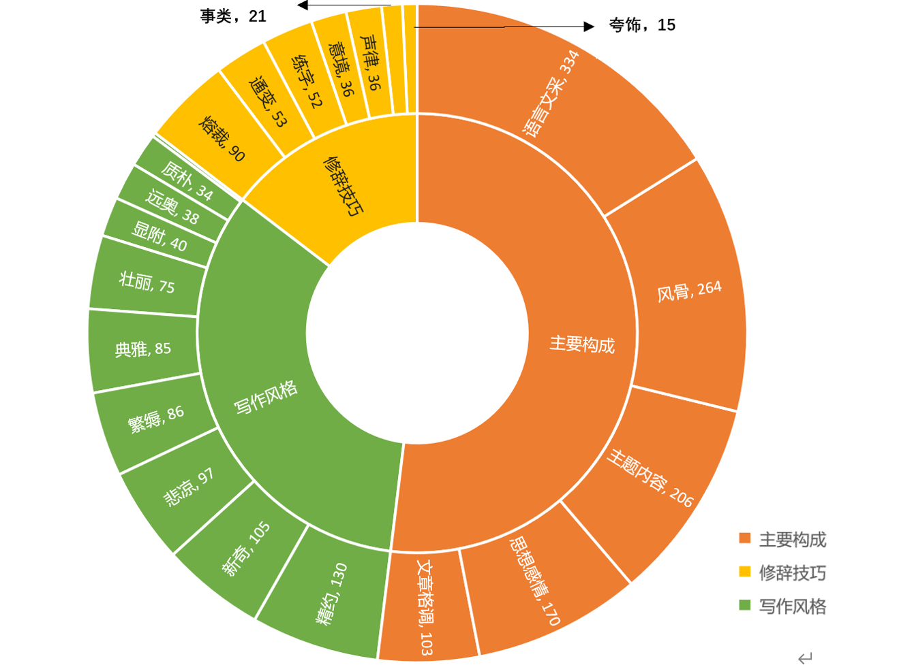
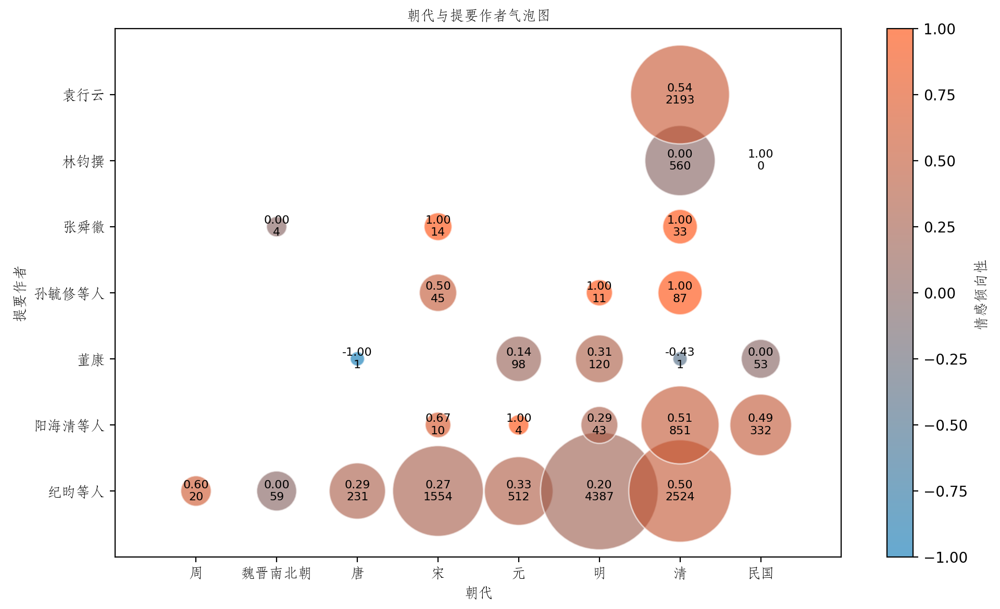
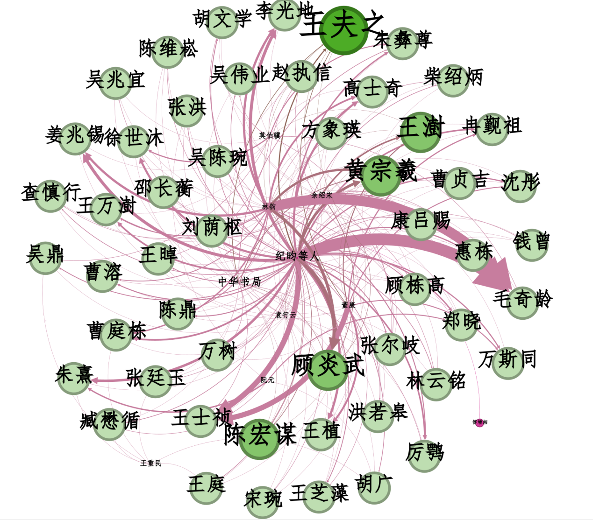

# 提要式书目数据集与检索系统
提要目录是古典目录体制下的一种，也称解题、题识、读书志等。传统古籍书目仅著录一书的题名、卷次、著者和版本等基本信息，提要则尽可能详细地将全书内涵、作者生平、学术源流、个人评论、书籍流传等信息全部钩稽出来，
这对学者快速定位所需古籍、了解古籍内容概要和获取线索大有裨益，是古代目录学“辨章学术，考镜源流”的重要体现。本项目依照全面性、权威性、版权保护、版本选择四大原则，选取了47本提要书目进行数字化和字段信息抽取，
构建起包含题名、卷数、部类、版本、责任者等24个字段，共计59,624条记录的提要目录数据集。并且基于微调后的GujiBERT模型对提要文本进行实体抽取，得到1,669,117条提要实体记录。同时部署上线了提要目录检索系统，
提供提要全文的一站式可视化检索和数据集下载。  
## 提要目录数据集
47本提要选目及类型一览

| 书名 | 综合性/专题性 | 官修/私撰 |	古典/现代 |
| :---: | :---: | :---: | :---: |
| 四库全书总目提要 | 综合性书目 | 官修书目	| 古典书目 |
|藏园群书经眼录|综合性书目|	私撰书目|	古典书目|
|中国善本书提要|	综合性书目|	官修书目|	现代书目|
|郘亭知见传本书目|	综合性书目|	私撰书目|	古典书目|
|崇文总目辑释|	综合性书目|	官修书目|	古典书目|
|直斋书录解题|	综合性书目|	私撰书目|	古典书目|
|上海图书馆馆藏家谱提要|	专题性书目|	官修书目|	现代书目|
|清人诗集叙录	|专题性书目	|私撰书目|	现代书目|
|文选楼藏书记|	综合性书目|	私撰书目|	古典书目|
|郑堂读书记|	综合性书目|	私撰书目|	古典书目|
|皕宋楼藏书志|	综合性书目|	私撰书目|	古典书目|
|郡斋读书志|	综合性书目|	私撰书目|	古典书目|
|中南、西南地区省、市图书馆馆藏古籍稿本提要|	综合性书目|	官修书目|	现代书目|
|铁琴铜剑楼藏书目录|	综合性书目|	私撰书目	|古典书目|
|中国通俗小说总目提要	|专题性书目|	官修书目|	现代书目|
|嘉业堂藏书志	|综合性书目|	私撰书目	|古典书目|
|石庐金石书志|	专题性书目|	私撰书目|古典书目|
|五十万卷楼藏书目录初编|	综合性书目	|私撰书目|	古典书目|
|书画书录解题|	专题性书目|	私撰书目	|古典书目|
|荛圃藏书题识	|综合性书目|	私撰书目	|古典书目|
|持静斋藏书记要|	综合性书目|	私撰书目|	古典书目|
|曲海总目提要|	综合性书目|	私撰书目|	古典书目|
|爱日精庐藏书志|	综合性书目|	私撰书目|	古典书目|
|天禄琳琅书目后编|	综合性书目|	官修书目|	古典书目|
|文禄堂访书记|	综合性书目|	私撰书目|	古典书目|
|中国印谱解题|	专题性书目|	私撰书目|	现代书目|
|钦定天禄琳琅书目|	综合性书目|	官修书目|	古典书目|
|四部备要书目提要	|综合性书目|	私撰书目|	古典书目|
|士礼居藏书题跋记|	综合性书目|	私撰书目|	古典书目|
|仪顾堂题跋|	综合性书目|	私撰书目|	古典书目|
|拜经楼藏书题跋|	综合性书目|	私撰书目|	古典书目|
|中国农学书录|	专题性书目|	私撰书目|	现代书目|
|绛云楼题跋|	综合性书目|	私撰书目|	古典书目|
|读书敏求记|	综合性书目|	私撰书目|	古典书目|
|四库未收书目提要|	综合性书目|	私撰书目	|古典书目|
|中国史学名著题解|	专题性书目|	私撰书目	|现代书目|
|东湖丛记|	综合性书目|	私撰书目	|古典书目|
|滂喜斋藏书记|	综合性书目|	私撰书目	|古典书目|
|楹书隅录|	综合性书目|	私撰书目	|古典书目|
|宝礼堂宋本书录|	综合性书目|	私撰书目|	古典书目|
|宋元旧本书经眼录|	综合性书目|	私撰书目|	古典书目|
|红雨楼题跋|	综合性书目|	私撰书目	|古典书目|
|绩语堂题跋|	综合性书目|	私撰书目|	古典书目|
|半毡斋题跋|	综合性书目|	私撰书目|	古典书目|
|古泉山馆题跋|	综合性书目|	私撰书目|	古典书目|
|日本访书志补|	综合性书目|	私撰书目|	古典书目|
|经义考补正|	专题性书目|	私撰书目|	古典书目|

提要目录数据集字段说明如下表  
| 字段名称 | 字段描述 | 示例 |
| :---: | :---: | :---: |
|ID|	提要记录唯一标识编码，共八位，前三位编码记录书名，后五位编码则是该书中提要记录依次编号|	10200097|
|书名|	提要书目的名称|	爱日精庐藏书志|
|来源作者|	提要书目的作者|	[清]张金吾|
|题名|	提要作品名称，通常由题名和卷数组成|	春秋纂言十二卷总例五卷|
|所在卷数|	该篇提要在提要书目的位置|	爱日精庐藏书志卷六|
|主题名	|由题名拆分而来，标明文章、作品等内容的词组、短语或短句|	春秋纂言|
|卷数|	由题名拆分而来，说明作品由几卷组成|	十二卷|
|并列题名|	由题名拆分而来，与主题名并列出现的其他内容|	总例五卷|
|所属部|	古代书目分类的一级类目|	经部|
|类别|	古代书目分类的二级类目，是对一级类目的细分|	春秋类|
|版本项|	提要中记录的有关古籍版本的信息，版本是指同一部书在编辑、传抄、刻版、装帧、乃至于流通过程中所产生的各种形态的本子。|	明万历间刻本|
|版本朝代|	由版本项拆分而来，记录该版本出现的朝代|	明|
|版本类型|	由版本项拆分而来，古籍的版本类型|	刻本|
|责任者项|	对作品的知识内容或艺术内容负责任的个人或团体以及其对应的责任方式|	汉郑玄注 唐贾公彦疏 唐陆德明释文|
|责任者朝代1|	由责任者项拆分而来，责任者所处的朝代|	汉|
|责任者1|	由责任者项拆分而来，责任者的名称|	郑玄|
|责任方式1|	由责任者项拆分而来，责任者项目中的有机组成部分。通过责任方式的描述，表示著作的形成过程和责任者对著作负有的责任类型|	注|
|责任者朝代2|	同责任者朝代1|	唐|
|责任者2|	同责任者1|	贾公彦|
|责任方式2|	同责任者方式1|	疏|
|责任者朝代3|	同责任者朝代1|	唐|
|责任者3|	同责任者1|	陆德明|
|责任方式3|	同责任者方式1|	释文|
|提要|	根据一定的体例编写的,对书籍的作者、卷次、内容和版本源流及其考证、评价等简要说明|	明庐陵谢子方著，海虞魏祐校。前有孙鼎序，谓子方洪武初名儒，其书止于上下经，举经文可出题者分段解之。兔园册耳，然尚出元明间人手。且《四库》未收，可与《群英书义》并存也。怡府藏书。附藏印“明善堂览书画印记”、“安乐堂藏书记”|

数据集下载参见[Synopsis_bibliography_dataset](/Synopsis_bibliography_dataset)文件
## 提要目录实体集
由于古籍提要实体标注数据集的缺乏，本项目以古籍提要目录数据集为基础，采取按比例分层抽样的方式,选取935条提要数据作为标注样本,定义的提要实体类型主要有以下七种：
|实体标签|	实体类别|	实体示例|
| :---: | :---: | :---: |
|PER|	人名|	章敞|
|LOC	|地名|	会稽|
|TIM	|时间|	永乐甲申|
|BOO|	著作|	《永乐大典》|
|STA|	社会身份|	侍郎|
|ORG|	组织机构|	礼部|
|SEA|	藏书印|	金元功藏书记|

标注数据集见[提要实体标注数据集](/Synopsis_bibliography_entities/提要实体标注数据集)  
使用[GujiBERT](https://github.com/hsc748NLP/GujiBERT-and-GujiGPT)模型在提要标注数据集上训练，模型在测试集上表现出的准确率为0.9575，精确率为0.8204，召回率为0.8558，f1值0.8377。  
微调后的提要实体抽取模型见[提要实体抽取模型(微调GujiBert)](/Synopsis_bibliography_entities/提要实体抽取模型(微调GujiBert).zip)
## 提要目录检索系统
提要目录检索系统后端采用Springboot集成Elasticsearch，提供了高性能的搜索功能，适合执行复杂的文本检索和数据分析。前端采用Vue.js框架开发，通过集成Echarts组件，提供丰富的图表类型和数据交互能力。系统源码见[Synopsis_bibliography_retrieval_system](/Synopsis_bibliography_retrieval_system)项目文件
## 基于提要式书目的人物信息挖掘研究
采用词频统计、情感分析、社会网络分析的方法，结合史料对抽取出的信息进行人物分析、定量统计和关系挖掘，尝试从人物基本特征、整体评价、写作风格评价、人物关系等多个维度进行剖析

作品评价词统计

各朝代作者评价数量和情感倾向气泡图

高频人物评价关系网络图

## 关于我们
如有疑问，欢迎来信咨询（yanxj9@mail2.sysu.edu.cn）
